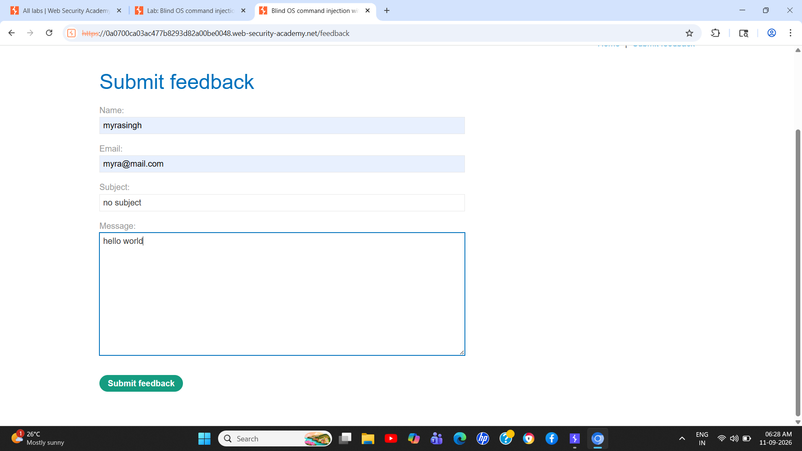
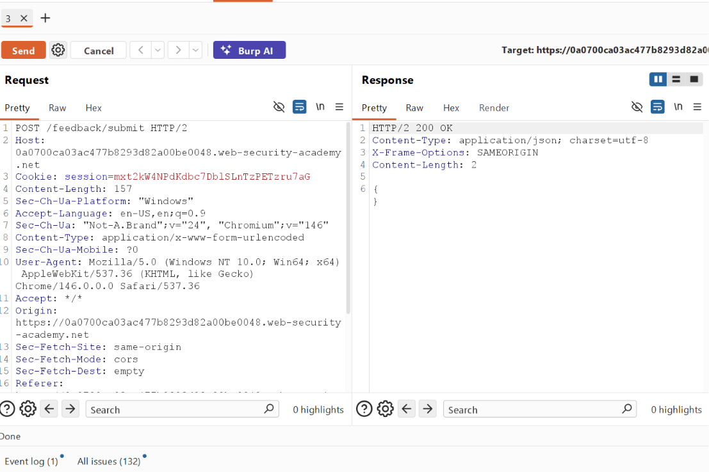
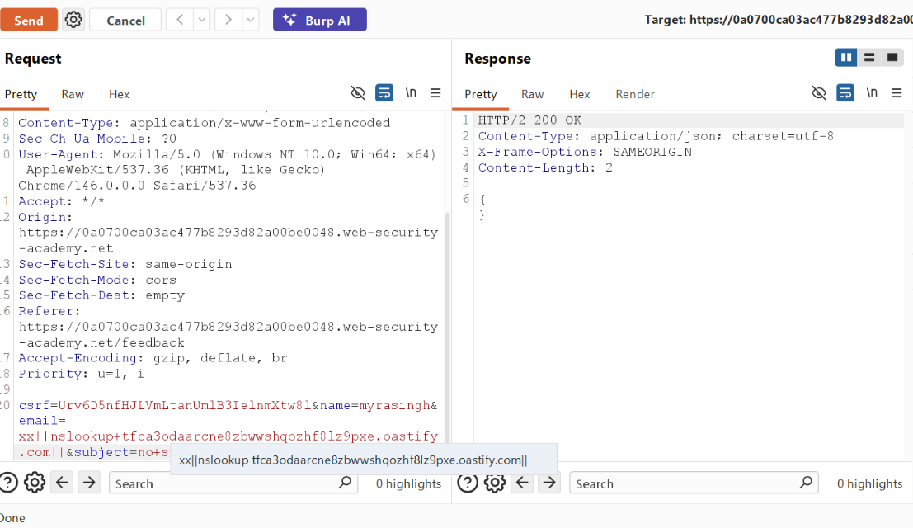
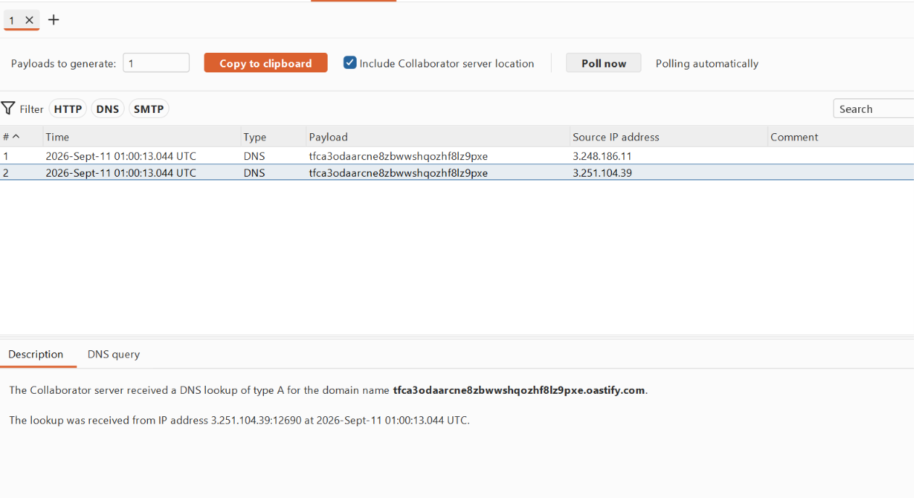

# Finding: OS Command Injection

## Severity

**High**

## Vulnerability Type

**OS Command Injection**

## Affected Endpoint

```http
POST /feedback/submit
```

## Affected Parameter

```text
email
```

## Description

The application is vulnerable to **OS Command Injection** through the user-controlled `email` parameter.

During testing, user-supplied input was found to reach a server-side command execution context without adequate validation or safe handling. By manipulating the parameter and introducing command execution syntax, it was possible to influence commands executed by the underlying operating system.

The vulnerability was also validated using a **blind command injection technique**, where command execution was confirmed through an external DNS interaction with Burp Collaborator.

## Technical Details

The vulnerable functionality is the feedback submission endpoint:

```http
POST /feedback/submit
```

The `email` parameter accepts user-controlled input.

The request was first captured using Burp Suite and sent to Burp Repeater to establish the application's normal behavior.

The parameter was then tested with command-injection payloads. Testing progressed from basic command-injection techniques to blind command execution.

Burp Collaborator was used to detect an out-of-band DNS interaction generated as a result of the server processing the injected input. This interaction provided evidence that attacker-controlled input reached an operating-system command execution context.

## Steps to Reproduce

1. Access the application's feedback functionality.
2. Submit the feedback form using a valid email address.
3. Capture the request using Burp Suite.
4. Send the captured request to Burp Repeater.
5. Observe the normal application response.
6. Identify the user-controlled `email` parameter.
7. Test the parameter with appropriate OS command-injection payloads.
8. Test for blind command injection where command output is not directly returned in the HTTP response.
9. Configure a Burp Collaborator interaction and use the generated domain in the test payload.
10. Send the modified request.
11. Monitor Burp Collaborator for an external DNS interaction.
12. Observe the interaction generated after the server processes the malicious input.

## Evidence

### 1. Feedback Form

The feedback functionality accepts an email address supplied by the user.



---

### 2. Original Request

The normal feedback submission request is captured in Burp Suite and sent to Repeater for testing.



---

### 3. Command Injection Payload

The user-controlled `email` parameter is modified with a command-injection payload.



---

### 4. Blind Command Injection

The modified request is processed without directly returning command output in the HTTP response, indicating a blind command-execution scenario.


---

### 5. Burp Collaborator Interaction

Burp Collaborator records the resulting DNS interaction generated by the server, providing out-of-band evidence of command execution.



## Impact

Successful exploitation of OS Command Injection can allow an attacker to execute arbitrary operating-system commands with the privileges of the vulnerable application process.

Potential consequences include:

* Unauthorized access to files accessible by the application process.
* Execution of unauthorized operating-system commands.
* Disclosure or modification of accessible server-side data.
* Compromise of application functionality.
* Potential further compromise of the underlying server depending on the privileges available to the application process.

The confirmed finding demonstrates server-side command execution through attacker-controlled input. The ultimate level of system compromise depends on the privileges and security controls of the affected application environment.

## Root Cause

The application processes user-controlled input in a context where it can influence operating-system command execution.

Insufficient input handling and the use of unsafe command execution mechanisms allow attacker-controlled data to reach the operating-system command interpreter.

## Remediation

* Avoid operating-system command execution where an application-level API can perform the required operation.
* Use safe APIs that do not invoke a shell.
* Separate user-controlled data from executable commands.
* Use parameterized process-execution interfaces when command execution is unavoidable.
* Apply strict server-side input validation using an allowlist appropriate to the expected input format.
* Do not rely solely on blacklisting command separators or special characters.
* Run the application using the minimum operating-system privileges required.
* Isolate sensitive application components using appropriate sandboxing or containerization controls.
* Monitor and log suspicious command-execution attempts.

## OWASP Classification

**OS Command Injection**

## Environment

This vulnerability was identified during an authorized security testing exercise.

## Security Testing Note

Testing was performed against an authorized laboratory environment for educational and defensive security purposes.
