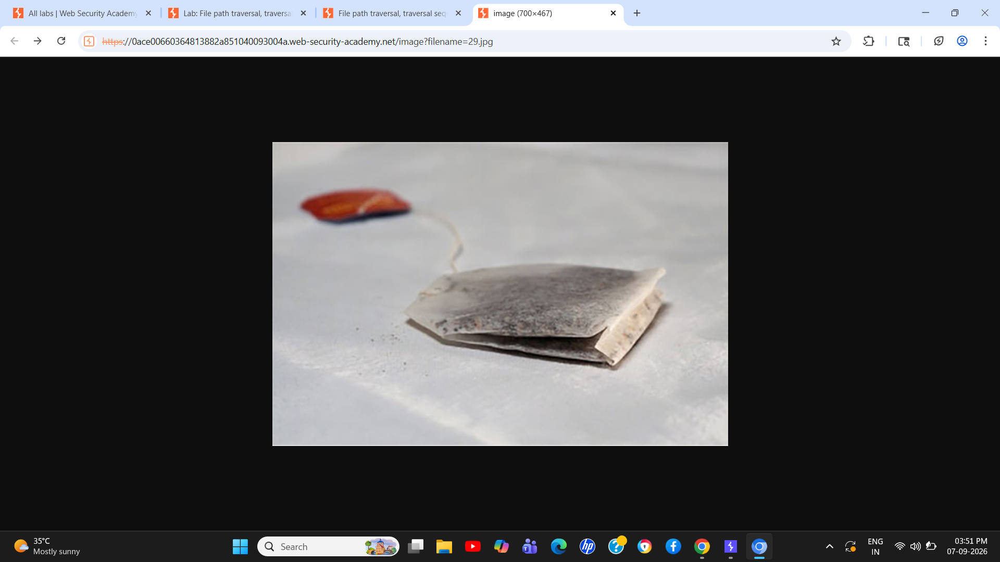
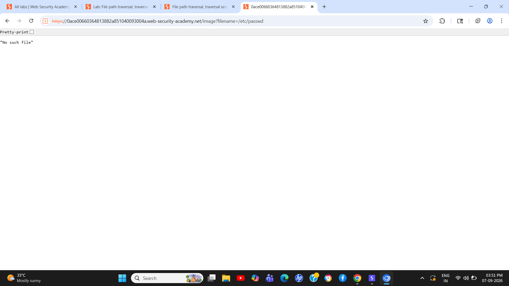
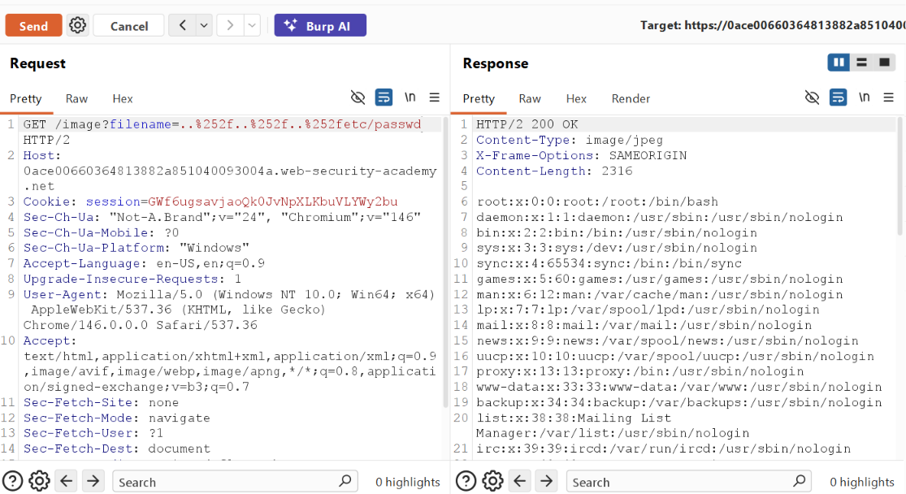

# Finding: Path Traversal via Encoded Path Traversal Sequence

## Severity

**High**

## Vulnerability Type

**Path Traversal / Directory Traversal**

## Affected Endpoint

```http
GET /image?filename=29.jpg
```

## Description

The application is vulnerable to **Path Traversal** because the `filename` parameter is used to determine which file is retrieved by the server without sufficiently restricting access to the intended directory.

During testing, the application was found to perform validation against path traversal sequences. However, the validation could be bypassed by using encoded and double-encoded representations of traversal sequences.

This allowed traversal beyond the intended directory and created the possibility of accessing files outside the application's permitted file location.

## Technical Details

The application provides an image-loading functionality through the following endpoint:

```http
GET /image?filename=29.jpg
```

The `filename` parameter is controlled by the client.

Testing showed that direct path traversal sequences were subject to filtering. However, the validation relied on detecting specific input patterns rather than securely resolving and restricting the resulting filesystem path.

Encoded and double-encoded traversal representations were used to bypass the filtering mechanism.

This demonstrates that the application performs insufficient canonicalization and path validation before accessing the requested file.

## Steps to Reproduce

1. Identify an endpoint that retrieves an image based on a user-controlled filename.
2. Observe the normal request:

```http
GET /image?filename=29.jpg
```

3. Intercept the request using Burp Suite.
4. Test the `filename` parameter for path traversal behavior.
5. Observe that direct traversal sequences are blocked by the application.
6. Modify the traversal payload using an encoded representation.
7. If necessary, test a double-encoded representation.
8. Send the modified request.
9. Observe that the server processes the encoded traversal sequence and attempts to resolve a path outside the intended image directory.
10. Verify access to a file outside the intended directory where supported by the lab.

## Evidence

### 1. Normal Image Request

The application requests an image using the user-controlled `filename` parameter.



---

### 2. Direct Path Traversal Attempt

A direct path traversal sequence is submitted to the `filename` parameter and is blocked by the application.



---

### 3. Encoded / Double-Encoded Traversal

The traversal sequence is encoded to bypass the application's input filtering.



---

### 4. File Access After Filter Bypass

The modified request is processed by the server, demonstrating that the validation can be bypassed and the file path can be manipulated beyond the intended directory.


## Impact

The confirmed security impact is:

* Unauthorized access to files outside the intended application directory.
* Potential disclosure of sensitive files accessible to the application's operating-system account.
* Loss of confidentiality of server-side files.

The severity of the impact depends on which files are accessible through the vulnerable functionality.

### Impact Not Confirmed

The following impacts should **not** be claimed as demonstrated unless separately verified:

* Remote Code Execution (RCE)
* Local File Inclusion (LFI)
* Remote File Inclusion (RFI)
* Creation or execution of malicious files

These may be possible in specific application configurations, but they were not demonstrated by the evidence documented in this assessment.

## Root Cause

The vulnerability is caused by insufficient server-side validation and canonicalization of the user-controlled `filename` parameter.

The application attempts to block known path traversal sequences but does not adequately normalize and validate the final resolved filesystem path before accessing it.

As a result, encoded representations of traversal sequences can bypass the filtering mechanism.

## Remediation

* Do not directly use client-controlled input as a filesystem path.
* Resolve and canonicalize the requested path before accessing the filesystem.
* Verify that the canonicalized path remains inside the intended application directory.
* Use an allowlist of permitted filenames or server-side file identifiers where possible.
* Reject absolute paths and traversal attempts.
* Perform validation after URL decoding and canonicalization.
* Do not rely solely on blacklisting strings such as `../`.
* Run the application with the minimum filesystem permissions required.
* Prevent the application account from reading sensitive system files.

## OWASP Classification

**Path Traversal / Directory Traversal**

## Environment

This vulnerability was identified during an authorized PortSwigger Web Security Academy laboratory exercise.

## Security Testing Note

Testing was performed against the intentionally vulnerable laboratory environment for educational and defensive security purposes.
